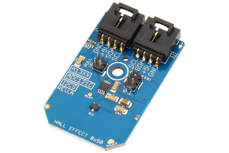

[](https://www.controleverything.com/content/Hall-Effect?sku=ADC121C_A13XX_I2CS_A1304ELHLX-05-T)
# A13XX
A13XX Hall Effect Sensor.

The A13XX provides a linear voltage output in proportion to a magnetic field.

This Device is available from ControlEverything.com [SKU: ADC121C_A13XX_I2CS_A1304ELHLX-05-T]

https://www.controleverything.com/content/Hall-Effect?sku=ADC121C_A13XX_I2CS_A1304ELHLX-05-T

This Sample code can be used with Raspberry pi, Arduino and Particle.

## Java
Download and install pi4j library on Raspberry pi. Steps to install pi4j are provided at:

http://pi4j.com/install.html

Download (or git pull) the code in pi.

Compile the java program.
```cpp
$> pi4j A13XX.java
```

Run the java program.
```cpp
$> pi4j A13XX
```

## Python
Download and install smbus library on Raspberry pi. Steps to install smbus are provided at:

https://pypi.python.org/pypi/smbus-cffi/0.5.1

Download (or git pull) the code in pi. Run the program.

```cpp
$> python A13XX.py
```

## Arduino
Download and install Arduino Software (IDE) on your machine. Steps to install Arduino are provided at:

https://www.arduino.cc/en/Main/Software

Download (or git pull) the code and double click the file to run the program.

Compile and upload the code on Arduino IDE and see the output on Serial Monitor.


## Particle Photon

Login to your Photon and setup your device according to steps provided at:

https://docs.particle.io/guide/getting-started/connect/photon/

Download (or git pull) the code. Go to online IDE and copy the code.

https://build.particle.io/build/

Verify and flash the code on your Photon. Code output is shown in logs at dashboard:

https://dashboard.particle.io/user/logs

#####The code output is the magnetic angle.
